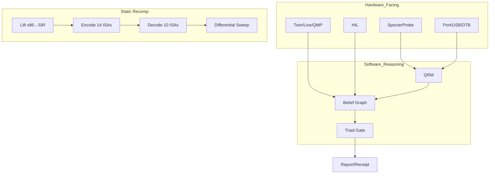

# B.A.S.E. — Behavioral ASIC Synthesis Engine

[](https://github.com/bmcc-DEV/B.A.S.E./actions/workflows/ci.yml)
[](https://github.com/bmcc-DEV/B.A.S.E./actions/workflows/formal.yml)
[](LICENSE.md)

> *"O que este hardware faz?" em vez de "Como este hardware foi implementado?"*

**Plataforma de engenharia reversa automatizada assistida por evidência** — percepção HW + raciocínio SW (QRM / belief / triad).

> **Honesty:** `generates_os: false` · `auto_fix_complete: false` · `static_recomp_complete: false` · flash = lab assist / manual
> ≠ OS turnkey · ≠ PCB fabricável · ≠ HIL production · ≠ Transformer · ≠ Wine/Win32 completo

---

## 16 crates · 14 ISAs · 18 SIR kinds · P6.1 traps

| Crate | Papel | Estado |
|-------|-------|--------|
| `specterprobe` | Lift binário → IR SSA + MMIO discovery | **REAL** |
| `base-core` | Tipos, inferência, solver, SMT, tensão Ψ, paleo/phylo, honesty | **REAL** |
| `base-recomp` | x86 → SIR → encode/decode/emit **14 ISAs** + preservação semântica (P0–P6) | **EXPERIMENTAL** |
| `base-reason` | QRM → belief graph → hipóteses → triad → report (≠ Transformer) | **REAL** |
| `base-virt` | QEMU live (QMP, NDJSON, twin↔guest, BIR bridge, continuous diff) | **EXPERIMENTAL** |
| `base-port` | USB×DT, wedge P0, address/driver maps, fossil inventory | **EXPERIMENTAL** |
| `base-hil` | USB probe, flash mock/live, Lab Gate A (5 checks) | **REAL*** |
| `base-api` | REST `/v1/identify` · `/v1/prove` · OpenAPI (`saas_production=false`) + portal web em `/` | **REAL** |
| `base-bir` | BIR type system, validation, contract extraction | **REAL** |
| `base-bsl` | BSL → BIR compiler | **REAL** |
| `base-check` | Dual-trace comparison, refuses self-pass | **REAL** |
| `base-vm` | Specter VM (Forth-like + Lua policy) | **REAL** |
| `base-fw` | C firmware gen (bootloader/HAL/drivers/Zephyr) | **REAL** |
| `base-pcb` | KiCad schematic/BOM/PCB/DRC (`NOT FABRICABLE`) | **REAL** |
| `base-evolve` | Bottleneck analysis → migration plan | **REAL** |
| `base-paleo` | StratAlign + phylogenetics (CLI `paleo`) | **REAL** |

Excluído do workspace: `base-learn` (ONNX/classifier — placeholder).

---

## Divisão HW / SW

```text
Firmware / USB / DTB / QMP
        ↓
   Hardware-facing (Specter · wedge · twin · HIL)
        ↓
   Evidence DB → BIR → Contracts → Solver → Reference Design
        ↓
   base-reason (QRM · belief · triad) → report / receipt draft
        ↓
   study / reconstruct / [PCB·FW draft opcional]
```

---

## Preservação semântica (Path v1.9 + P6.1)

> B.A.S.E. preserva a **semântica** de 14 arquiteturas-alvo, não apenas executa binários.

| ISA | Encode | Decode | Differential | Conditional | Trap | Preservation |
|-----|--------|--------|--------------|-------------|------|-------------|
| **x86_64** | ✅ 18/18 | ✅ | ✅ | ✅ Cmp/Test/BC | ✅ ud2 | P6.1 |
| **AArch64** | ✅ 18/18 | ✅ | ✅ | ✅ Cmp/Test/BC | ✅ brk | P6.1 |
| **ARM** | ✅ 18/18 | ✅ | ✅ | ✅ Cmp/Test/BC | ✅ bkpt | P6.1 |
| **ColdFire** | ✅ 18/18 | ✅ | ✅ | ✅ Cmp/Test/BC | ✅ illegal | P6.1 |
| **PPC** | ✅ 18/18 | ✅ | ✅ | ✅ 8 BO/BI conds | ✅ trap | P6.1 |
| **SPARC** | ✅ 18/18 | ✅ | ✅ | ✅ Cmp/Test/BC | ✅ ta 1 | P6.1 |
| **MIPS** | ✅ 15/18 | ✅ | ✅ | — sem flags | ✅ break | P5.1 |
| **SuperH** | ✅ 15/18 | ✅ | ✅ | — T flag only | ✅ trapa | P5.1 |
| **Alpha** | ✅ 15/18 | ✅ | ✅ | — sem flags | ✅ call_pal | P5.1 |
| **PA-RISC** | ✅ 15/18 | ✅ | ✅ | — sem flags | ✅ break 0,0 | P5.1 |
| M88k · IA-64 · i860 | emit texto | — | — | — | ✅ emit | P1 |

```text
P1: catálogo existe                    P4: comportamento em subset real
P2: round-trip de formato              P5: sweep sealed (≥67%)
P3: subconjunto semântico              P6: 100% todas dimensões + sweep condicional limpo
                                       P6.1: P6 + Trap emit 14 ISAs
```

18 SIR kinds: Nop, Ret, MovImm, AddImm, SubImm, Clear, Inc, Dec, Push, Pop, LdMem, StMem, CallRel, JmpRel, Cmp, Test, BranchCond, Trap.
14 Cond variants: Eq, Ne, Lt, Ge, Gt, Le, Cs, Cc, Mi, Pl, Vs, Vc, Hi, Ls.
70 conditional sweep programs (Cmp×3 outcomes×14 + Test×2 outcomes×14).

```bash
base recomp semantics                          # catálogo 13 ISAs + JSON
base recomp verify --hex 90C3 --target mips    # round-trip por ISA
base recomp verify --all                       # cobertura 18 kinds × 6 dimensões
base recomp verify --sweep --target coldfire   # sweep comportamental + condicional
base recomp report --isa mips                  # preservation report (P0–P6)
base recomp report --matrix                    # matriz por ISA
```

Verifier **já pegou bugs reais**: PPC `r0` (lê como 0 no RA de `addi`), ColdFire `Dn` (bits 5-3 sem shift), executor i32↔u32 (gap Alpha sign-extension). Eixos `abi/privileged/mmu/system` = **0%** (não modelados).

Fonte: [docs/STATIC_RECOMP.md](docs/STATIC_RECOMP.md) · [vault/isa/](base-vault/isa/README.md)

---

## CLI

| Comando | Notas |
|---------|-------|
| `analyze` / `synth` / `design` | Evidence → Reference Design |
| `reason` | QRM + belief + triad → report + receipt draft |
| `port` | package · usb-probe · usb-cross · wedge-p0 · clocks-pinctrl |
| `virt` | ingest · score · run · qmp · study · twin · bir-twin · watch |
| `hil` | enumerate · flash · lab-status (host REAL\*; production gated) |
| `study` | Specter VM Forth+Lua (loop autónomo; `auto_fix_complete=false`) |
| `reconstruct` | Structural refinement (stop_reason; ≠ auto-fix) |
| `replay` / `prove` / `event-graph` | Contratos → violações / SMT-LIB / DOT |
| `bir` | compile · validate · to-legacy · dot |
| `recomp` | lift · encode · decode · semantics · verify · report · elf · pe |
| `evolve` / `fw` / `pcb` / `check` / `pipeline` | Outputs + validação |
| `paleo` | align · excavate · phylo |
| **API** (`base-api`) | `/v1/identify` · `/v1/prove` · `/v1/usage` · OpenAPI · portal forense em `/` |

---

## Wedges / smokes

| Wedge | Smoke | CI |
|-------|-------|----|
| RP UART / SPI | `run.sh` · `run_t1_b2.sh` | ✅ |
| STM32 USART/SPI/I2C/TIM/triple | `pilot_stm32/run*.sh` | ✅ |
| Specter study | `pilot_study/run_study.sh` | ✅ |
| Moto G35 wedge P0 | `run_wedge_pipeline.sh` · `run_path_a.sh` | ✅ (fase A) |
| iMac G3 OS-port A | `pilot_imac_g3/run.sh` | ✅ (fase A) |
| Sega Saturn | `pilot_saturn/run.sh` | draft |
| HIL lab | `hil_lab/run_hil_lab*.sh` | ✅ |

---

## Quick Start

```bash
git clone https://github.com/bmcc-DEV/B.A.S.E..git
cd B.A.S.E.
cargo build -p base-cli

./examples/pilot/run.sh
./examples/pilot_study/run_study.sh
./examples/pilot_moto_g35/run_wedge_pipeline.sh
```

### Recomp / preservação semântica

```bash
cargo build -p base-cli
./target/debug/base recomp semantics
./target/debug/base recomp verify --hex B80100000083C002C3 --target mips -o output/verify
./target/debug/base recomp verify --all
./target/debug/base recomp verify --sweep --target coldfire
```

### Reason (G35)

```bash
./target/debug/base reason g35 -o output/reason_g35
# → reason_report.md · reason_receipt_draft.json (flashed: false)
```

### Análise / HIL

```bash
base analyze firmware.bin --mmio-traces mmio.json --classify uart -o output/
base hil enumerate -o /tmp/hil/
base hil flash /tmp/x.bin --mock-flash -o /tmp/hil/
```

---

## Arquitectura



### Tensão Ψ

```text
Ψ(B, H) = ∫ δ(ω_obs, ω_H) dμ
confidence = max(0, 1 - Ψ/(1+Ψ))
```

---

## Mercados / Claims

| Mercado | Papel |
|---------|-------|
| Forense / segurança | Wedge principal + reason loop |
| Educação / pesquisa | Pipeline + Ψ + Specter |
| Preservação industrial | Consultoria + SOW |
| SaaS | Adiado |

**Claims proibidos:** PCB fabricável · ASIC drop-in · HIL production · SaaS turnkey · auto-fix completa · OS turnkey · "produto industrial completo"

[`COMMERCIAL.md`](COMMERCIAL.md)

---

## Honesty gates

| Gate | Valor |
|------|-------|
| `GENERATES_OS` | false |
| `AUTO_FIX_COMPLETE` | false |
| `STATIC_RECOMP_COMPLETE` | false |
| `WIN32_ABI_COMPLETE` | false |
| `RUNS_ANY_PE` | false |
| `RUNS_ON_SATURN` | false |
| `RUNS_ON_DREAMCAST` | false |
| `saas_production` | false |
| flash `production` | false |

---

## Documentação

| Doc | Papel |
|-----|-------|
| [Static Recomp](docs/STATIC_RECOMP.md) | Pipeline recomp + preservação semântica |
| [Platform RE](docs/PLATFORM_RE.md) | Divisão percepção / raciocínio |
| [P6 Conditional](docs/P6_CONDITIONAL.md) | P6 spec: flags + branches |
| [Maturity Matrix](base-vault/12%20-%20Path%20to%20Real/12.02%20-%20Maturity%20Matrix.md) | Fonte da verdade |
| [ISA Preservation](base-vault/isa/README.md) | P0–P6 levels + regras de ouro |
| [CHANGELOG](CHANGELOG.md) | Tags v0.2–v1.8 + Unreleased |

---

## Licença

AGPLv3 — [LICENSE.md](LICENSE.md)
