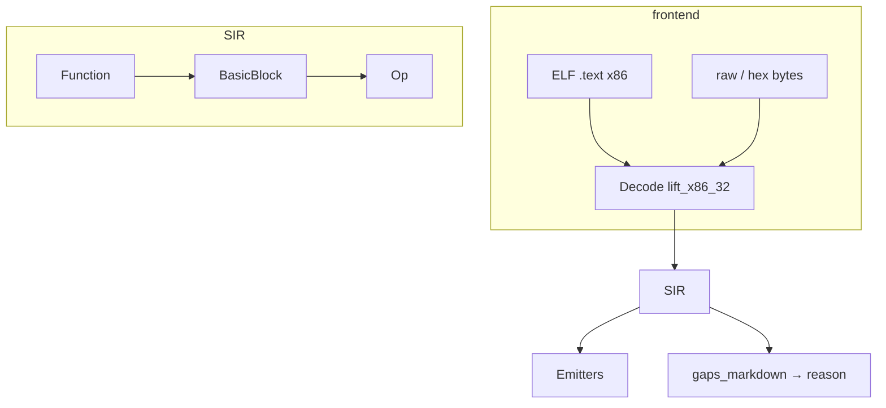

# SIR — Static Intermediate Representation

## Papel

SIR é a ponte **estática** entre bytes x86 e backends multi-ISA.

- **Não** é BIR (comportamento de HW / MMIO).
- **Não** é LLVM IR completo (pode baixar para LLVM depois).
- **É** um CFG de blocos + ops tipadas o suficiente para emitir ASM.

## Unidades

| Tipo | Conteúdo |
|------|----------|
| `Module` | Funções + `source` / `text_vma` opcionais |
| `Function` | Nome, blocos |
| `BasicBlock` | Lista de `Op` (linear no v1.7/v1.8) |
| `Op` | ver tabela abaixo |
| `VReg` | eax=0 … edi=7 |

### `Op` (implementado)

| Op | Origem típica |
|----|----------------|
| `Nop` · `Ret` | `90` · `C3` |
| `MovImm` | `B8+r iv` |
| `AddImm` · `SubImm` | `05`/`2D` · `83 /0`/`/5` |
| `Clear` | `31/33` xor r,r |
| `Inc` · `Dec` | `40+r` · `48+r` |
| `Push` · `Pop` | `50+r` · `58+r` |
| `CallRel` · `JmpRel` | `E8`/`E9`/`EB` — emit = `ud2` até symbols |
| `Unknown` | gap → `gaps_markdown` |

*Não implementados ainda:* `Load`/`Store` genéricos, CFG com sucessores, PE.

## Relação com o resto do B.A.S.E.

| Artefacto | Uso |
|-----------|-----|
| SpecterProbe Capstone | HW ARM64; Capstone x86 **deferred** (Path v1.8 S4) |
| BIR | HW behavior — paralelo |
| `gaps` + `base-reason` | Relatório de gaps; Questions manuais a partir do report |
| ELF loader | Só `X86_64` / `I386` |
| Honesty | `static_recomp_complete: false` |

## Saídas

| Artefacto | Formato |
|-----------|--------|
| `recomp.sir.json` | SIR |
| `emit_<isa>.s` | ASM |
| `RECOMP_REPORT.md` | Gaps + honesty |

[[27.00 - Index]] · [[28 - Path to v1.8/28.00 - Index]]
